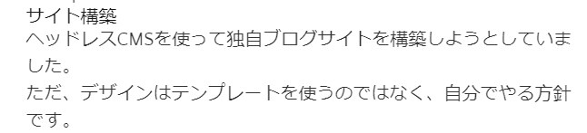

---
---
## Tailwind CSSを導入（中止）

CSSをあまり知らずに自由にカスタマイズができそうなので導入します。  
⇒MarkdownのHTML変換後のスタイルの当て方がよくわからないので中止します。  

## 他の方法を検討
CSS in JSの勉強も兼ねて、"Styled Components"を導入します。  
ここのサイトに詳しく書いてあったので、ここを参考に実装します。  
[Gatsbyブログサイト移行物語](https://ginneko-atelier.com/blogs/entry484/)  

[ここの途中まで実施](https://ginneko-atelier.com/blogs/entry406/)  

### 見出しと分かるようにする
Markdownではこのように記載していますが、表示はどこが見出しか分かりません。  
『サイト構築』が見出しであると分かるようにします。

**Markdownの記載**
```markdown
# サイト構築

---

ヘッドレスCMSを使って独自ブログサイトを構築しようとしていました。  
ただ、デザインはテンプレートを使うのではなく、自分でやる方針です。  
```
**ブラウザの表示**  
  


## codeのシンタックスハイライトを入れる

Markdownに対応しているということでPrismを使います。  
ここを参照しながら進めます。  
[Gatsby（GatsbyJS）× Contentful RichText Markdownそれぞれのcodeシンタックスハイライトの適用方法](https://o-alquimista.com/blogs/gatsby-contentful/)

```bash:title=bash
$ yarn add gatsby-remark-prismjs prismjs
$ yarn add gatsby-remark-prismjs-title
$ yarn add gatsby-remark-code-titles
```

設定を入れます。  
画像の表示のために"gatsby-transformer-remark"を設定済みの場合、"gatsby-remark-code-titles"はoptionsの中に記載してください。
```javascript:title=gatsby-config.js
    `gatsby-transformer-remark`,
    {
      resolve: `gatsby-transformer-remark`,
      options: {
        plugins: [
          // Markdownファイルの中の画像を表示する
          `gatsby-remark-relative-images`,
          {
            resolve: `gatsby-remark-images`,
            options: {
              maxWidth: 700,
            },
          },
          // Prismの導入 gatsby-transformer-remarkが競合するため、入れ子で記載する
          // https://o-alquimista.com/blogs/gatsby-contentful/
          `gatsby-remark-code-titles`, //ファイルのタイトルを表示
          {
            resolve: `gatsby-remark-prismjs`,
            options: {
              classPrefix: "language-",
              inlineCodeMarker: null,
              aliases: {},
              showLineNumbers: false, //行数を出したい場合trueに。
              noInlineHighlight: false,
            },
          },
        ],
      },
    },
```


---
[Gatsby：イメージ（画像）を表示させるための作法](https://qiita.com/atomyah/items/e6aebf0a0abe3d488787)

### 2-2. 記事のAPIを決める

#### 共通(ヘッダー)
- ヘッダー
- パンくず

#### 記事固有

**制限: 使えるAPIは3つまで**
1. プロフィール
2. ブログ
3. SEO(仮、ブログに埋め込む可能性あり)

■ ブログAPI  

| フィールドID | 表示名 | 種類 |
| --- | --- | --- |
| summary | リード文 | リッチテキスト |
| title | タイトル | テキストフィールド |
| mainVisual | メインビジュアル | 画像 |
| body | 本文 | リッチエディタ |

summaryを使うか後で決める。bodyの先頭から取れる形にするかも。

- タイトル
- タグ⇒ドロップ
- 更新日⇒CMSから取る(取れないときはAPIに追加)
- 関連リンク⇒必要になったら後で追加
- メインビジュアル
- 記事
  - 目次
  - 広告
  - 見出し
  - 写真⇒記事ごとに追加する方法を考える
    - Onedrive参照にする
    - 画像APIを追加する
  - 文章
  - 吹き出し

#### 共通(サイドバー(右側))
- サイトインデックス
- 自己紹介⇒プロフィールから取る
- 検索窓
- 記事の目次（スクロール後固定）⇒後で必要になったら追加する

#### 共通(フッター)

- 記事一覧　抜粋
- 広告
- SNSリンク(全記事共通)

### 2-3. 記事のレイアウトを決める

### 気づき
- 外部リンクは別タブで開くようにする
