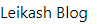

# 方針転換

- [方針転換](#方針転換)
  - [1. Githubでリポジトリ作成](#1-githubでリポジトリ作成)
  - [2. Gatsbyで空のサイトを作成](#2-gatsbyで空のサイトを作成)
    - [2.1 サイト作成](#21-サイト作成)
    - [2.2 Tailwind CSSの導入](#22-tailwind-cssの導入)
      - [2.2.1 インストール](#221-インストール)
      - [2.2.2 Gatsbyのplug-inに登録・設定](#222-gatsbyのplug-inに登録設定)
      - [2.2.3 動作確認](#223-動作確認)
      - [2.2 サンプル記事を作成](#22-サンプル記事を作成)
        - [2.2.1 フォルダ構成](#221-フォルダ構成)
  - [3. Markdownを加工せずに公開](#3-markdownを加工せずに公開)
    - [3.1. Markdown記事の取得](#31-markdown記事の取得)
  - [4. 記事にデコレーションをして公開](#4-記事にデコレーションをして公開)

---

ヘッドレスCMSを使って独自ブログサイトを構築しようとしていました。  
ただ、デザインはテンプレートを使うのではなく、自分でやる方針です。  
そうすると必要になるのが、APIで受け取ったHTMLをデコレーションする必要がでてきます。  
もともと、コンテンツを簡単に登録することだけが目的でヘッドレスCMSを使おうとしていたので  
Markdownで書いて、ローカルに保存するのが一番簡単ということに気づきました。

そこで、一旦サイトをMarkdownで記事を書く方向でサイトを作り直します。
この選択が吉とでるか、凶とでるかはまだわかりません。

---

## 1. Githubでリポジトリ作成
レポジトリ名を決めて新たにレポジトリを作成  
```bash
$ git clone https://github.com/leikash/markdown-blog.git
```

## 2. Gatsbyで空のサイトを作成

### 2.1 サイト作成
ここを参考にして作成  
[基礎から始めるGatsbyJS入門](https://reffect.co.jp/react/gatsby-basic-tutorial-for-beginners)

```bash
$ gatsby new blog-site https://github.com/gatsbyjs/gatsby-starter-hello-world
```

### 2.2 Tailwind CSSの導入  
カスタマイズはしたいけど、CSSを本格的に勉強するわけではないので、時間短縮のためにこちらを導入します。  
[Tailwind CSSの手順](https://tailwindcss.com/docs/guides/gatsby)、[Gatsbyの手順](https://www.gatsbyjs.com/docs/how-to/styling/tailwind-css/)を見ながらインストールします。

#### 2.2.1 インストール
まずは、ターミナルからインストール
```bash
$ yarn add tailwindcss postcss autoprefixer gatsby-plugin-postcss
$ npx tailwindcss init -p
```
#### 2.2.2 Gatsbyのplug-inに登録・設定
お決まりで、plug-inを入れたら、Gatsbyのplug-inに登録して、設定を行います。  
```javascript
// gatsby-config.js

module.exports = {
  plugins: [
    // ...
    'gatsby-plugin-postcss', //Setting for Tailwind CSS
    // ...
  ],
}
```
```javascript
// tailwind.config.js
module.exports = {
  content: [
    "./src/**/*.{js,jsx,ts,tsx}",
  ],
  theme: {
    extend: {},
  },
  plugins: [],
}
```
Tailwind CSSの手順にはこれが書いていなくてハマりました。  
postcss.config.jsをroot直下に作ります。
```javascript
// postcss.config.js
module.exports = () => ({
    plugins: [require("tailwindcss")],
})
```

Tailwind CSSが全体に適用されるように、'./src/styles/global.css'、root直下に'gatsby-browser.js'を作成します。  
```css
// global.css
@tailwind base;
@tailwind components;
@tailwind utilities;
```
```javascript
// gatsby-browser.js
import './src/styles/global.css'
```

#### 2.2.3 動作確認
正しく適用されたか動作確認します。  
```bash
$ yarn run develop
```
```javascript
//index.js
  <h1 className="text-4xl font-bold underline text-green-800">
    Leikash Blog
  </h1>
```


適用前: タイトルのh1タグがそのまま表示れています。  
  

適用後: 文字が緑になって、アンダーラインが追加されています。  
  

#### 2.2 サンプル記事を作成
記事を公開します。

##### 2.2.1 フォルダ構成
ブログ内に画像を貼り付けるため、src配下に以下のフォルダを作成します。  
|フォルダ|用途|
|---|---|
|draft|下書き用|
|draft/image|下書きの画像置き場|
|post|公開用|
|draft/image|ブログ用の画像置き場、公開用|

## 3. Markdownを加工せずに公開
見た目は悪くても公開できるように、  
まずはMarkdownのまま公開してみます。

### 3.1. Markdown記事の取得
ここを参照して進めます。
[GatsbyJSでのGraphQLの使い方](https://reffect.co.jp/react/gatsby-basic-tutorial-for-beginners-2)

## 4. 記事にデコレーションをして公開