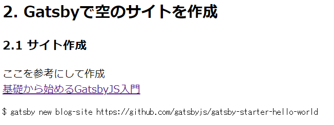

# Markdownファイルを表示

## 1. Markdownを加工せずに表示
見た目は悪くても公開できるように、  
まずはMarkdownのまま表示してみます。  

ここを参照して進めます。  
[GatsbyJSでのGraphQLの使い方](https://reffect.co.jp/react/gatsby-basic-tutorial-for-beginners-2)

そのままやれば表示できました。  

  

## 2. Markdownのファイルリストを作成
また、ここを参照して進めます。  
[GatsbyJSでの動的ページ自動作成方法を理解したい](https://reffect.co.jp/react/gatsby-basic-tutorial-for-beginners-3#slug)

