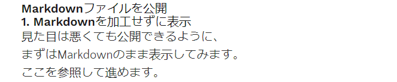

# Markdownファイルを公開

## 1. Markdownを加工せずに表示
見た目は悪くても公開できるように、  
まずはMarkdownのまま表示してみます。  
  
ここを参照して進めます。  
[GatsbyJSでのGraphQLの使い方](https://reffect.co.jp/react/gatsby-basic-tutorial-for-beginners-2)

そのままやれば表示できました。  
  

## 2. Markdownのファイルリストを作成
またここを参照して進めます。  
[GatsbyJSでの動的ページ自動作成方法を理解したい](https://reffect.co.jp/react/gatsby-basic-tutorial-for-beginners-3#slug)

### 2.1. gatsby-node.jsを作成する
記事一覧を作成するため、slugを作ります  
[スラッグとは](https://school.dhw.co.jp/course/graphic/contents/w_slug.html)  

IT用語で「位置を示すコード」等の意味とのことで、相対パスみたいなものと理解しました。

これで、記事の在り処を取ることができるようになりました。  

### 2.2. 動的ページの生成
前記事のslugを取得して、目次を作成します。
これも参照ページのコードをコピーして作ります  
トップページから各記事へアクセスできるようになりました。  

