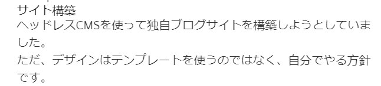

# 記事画面のレイアウトを整える

## Tailwind CSSを導入

CSSをあまり知らずに自由にカスタマイズができそうなので導入します。

### 見出しと分かるようにする
Markdownではこのように記載していますが、表示はどこが見出しか分かりません。  
『サイト構築』が見出しであると分かるようにします。

**Markdownの記載**
```markdown
# サイト構築

---

ヘッドレスCMSを使って独自ブログサイトを構築しようとしていました。  
ただ、デザインはテンプレートを使うのではなく、自分でやる方針です。  
```
**ブラウザの表示**
  


## codeのシンタックスハイライトを入れる

Markdownに対応しているということでPrismを使います。  
ここを参照しながら進めます。  
[Gatsby（GatsbyJS）× Contentful RichText Markdownそれぞれのcodeシンタックスハイライトの適用方法](https://o-alquimista.com/blogs/gatsby-contentful/)

```bash
$ yarn add gatsby-remark-prismjs prismjs
$ yarn add gatsby-remark-prismjs-title
$ yarn add gatsby-remark-code-titles
```

設定を入れます。  
画像の表示のために"gatsby-transformer-remark"を設定済みの場合、"gatsby-remark-code-titles"はoptionsの中に記載してください。
```javascript
// gatsby-config.js
    `gatsby-transformer-remark`,
    {
      resolve: `gatsby-transformer-remark`,
      options: {
        plugins: [
          // Markdownファイルの中の画像を表示する
          `gatsby-remark-relative-images`,
          {
            resolve: `gatsby-remark-images`,
            options: {
              maxWidth: 700,
            },
          },
          // Prismの導入 gatsby-transformer-remarkが競合するため、入れ子で記載する
          // https://o-alquimista.com/blogs/gatsby-contentful/
          `gatsby-remark-code-titles`, //ファイルのタイトルを表示
          {
            resolve: `gatsby-remark-prismjs`,
            options: {
              classPrefix: "language-",
              inlineCodeMarker: null,
              aliases: {},
              showLineNumbers: false, //行数を出したい場合trueに。
              noInlineHighlight: false,
            },
          },
        ],
      },
    },
```

