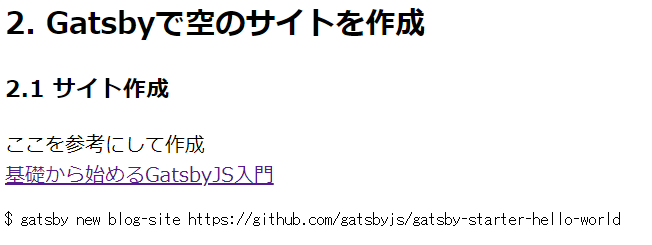

# Markdownファイルを表示

## 1. Markdownを加工せずに表示
見た目は悪くても公開できるように、  
まずはMarkdownのまま表示してみます。  

ここを参照して進めます。  
[GatsbyJSでのGraphQLの使い方](https://reffect.co.jp/react/gatsby-basic-tutorial-for-beginners-2)

そのままやれば表示できました。  

  

## 2. Markdownのファイルリストを作成
また、ここを参照して進めます。  
[GatsbyJSでの動的ページ自動作成方法を理解したい](https://reffect.co.jp/react/gatsby-basic-tutorial-for-beginners-3#slug)

### 2.1. gatsby-node.jsを作成する
記事一覧を作成するため、slugを作ります
slugとは、、、

### 2.2. 動作確認


## 3. 記事に画像をつける

### 3.1. Markdownファイルに画像を埋め込む
VsCodeのプラグインで適当な場所に画像を貼り付けます。
```markdown
  
```

### 3.2. Gatsbyのプラグインをインストール
```bash
$ yarn add gatsby-remark-images gatsby-plugin-sharp gatsby-remark-relative-images
```

gatsby-config.jsを設定して表示できました。

### サイトの画像を表示する
```bash
$ yarn add gatsby-image
```
gatsby-config.jsを設定
うごかない

[gatsby-imageは非推奨とのこと](https://www.gatsbyjs.com/plugins/gatsby-image/)  
代わりに"gatsby-plugin-image"を使います。  

```bash
$ yarn add gatsby-plugin-image
```

ロゴを入れることはできた。

---
# 時間切れで作ってない。ここから再開する
---

- [ ] postページのトップ画像をindexに入れる


設定を入れます。
```javascript
// gatsby-confi.js

```

